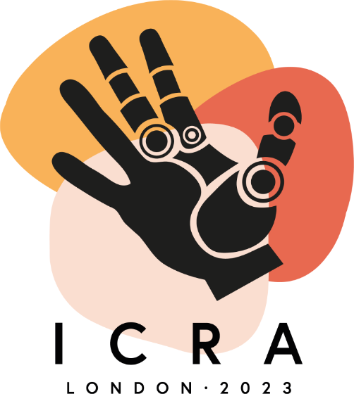

# ICRA-2023-review

  

This repository contains a collection of papers presented at the International Conference on Robotics and Automation (ICRA) 2023, which took place in London from May 29th to June 3rd 2023.

ICRA is a premier international forum for robotics researchers to present their latest work and exchange ideas with colleagues from around the world.

This repository is a similar attempt like PaoPaoRobot repositories [1] to collect research papers and resources in the field of robotics to have a good vision for future research. We hope that this repository will be a valuable resource for researchers, students, and anyone else interested in the latest developments in robotics and automation.

We have gathered supplementary materials such as PDFs, videos, and code for selected sessions that we found particularly relevant to our own research interests. However, we understand that there may be other papers in this collection that could benefit from additional resources and information. In order to make this repository as comprehensive and useful as possible, we welcome contributions from the community. If you have any relevant materials or insights related to any of the papers in this collection, please feel free to add them to this repository.

To make it easier to navigate the papers, they are organized by session. Each session has its own folder, and the papers presented in that session are stored in the corresponding folder.

- [3D Vision](./3DVision)
- [AI-Based Methods](./AIBasedMethods)
- [AI-Enabled Robotics](./AIEnabledRobotics)
- [Additive Manufacturing](./AdditiveManufacturing)
- [Aerial Robot Learning](./AerialRobotLearning)
- [Aerial Robotics (Orals)](./AerialRobotics)
- [Aerial Robotics I](./AerialRoboticsI)
- [Aerial Robotics II](./AerialRoboticsII)
- [Aerial Robots and Autonomous Agents (Orals)](./AerialRobotsandAutonomousAgents)
- [Aerial Systems: Manipulation and Control](./AerialSystemsManipulationandControl)
- [Aerial Systems: Mapping and Localization](./AerialSystemsMappingandLocalization)
- [Aerial Systems: Perception](./AerialSystemsPerception)
- [Agricultural Robotics and Automation I](./AgriculturalRoboticsandAutomationI)
- [Agricultural Robotics and Automation II](./AgriculturalRoboticsandAutomationII)
- [Assembly](./Assembly)
- [Autonomous Navigation](./AutonomousNavigation)
- [Benchmarking](./Benchmarking)
- [Bioinspiration and Biomimetics (Orals)](./BioinspirationandBiomimetics)
- [Biomimetic Systems](./BiomimeticSystems)
- [Calibration, Identification, and Simulation (Orals)](./CalibrationIdentificationandSimulation)
- [Calibration and Identification](./CalibrationandIdentification)
- [Collision Avoidance](./CollisionAvoidance)
- [Compliance and Impedance Control](./ComplianceandImpedanceControl)
- [Compliant Joints and Mechanisms](./CompliantJointsandMechanisms)
- [Compliant Mechanisms (Orals)](./CompliantMechanisms)
- [Computer Vision and Visual Servoing (Orals)](./ComputerVisionandVisualServoing)
- [Data Sets I](./DataSetsI)
- [Data Sets II](./DataSetsII)
- [Deep Learning Methods](./DeepLearningMethods)
- [Deep Learning and Neural Networks in Robotics (Orals)](./DeepLearningandNeuralNetworksinRobotics)
- [Deep Learning for Visual Perception (Orals)](./DeepLearningforVisualPerception)
- [Deep Learning for Visual Perception I](./DeepLearningforVisualPerceptionI)
- [Deep Learning for Visual Perception II](./DeepLearningforVisualPerceptionII)
- [Deep Learning in Grasping and Manipulation](./DeepLearninginGraspingandManipulation)
- [Depth Estimation and RGB-D Sensing](./DepthEstimationandRGB-DSensing)
- [Design of Mechanisms (Orals)](./DesignofMechanisms)
- [Environmental Applications](./EnvironmentalApplications)
- [Force and Tactile Sensing I](./ForceandTactileSensingI)
- [Force and Tactile Sensing II](./ForceandTactileSensingII)
- [Force and Tactile Sensing and Haptics and Haptic Interfaces (Orals)](./ForceandTactileSensingandHapticsandHapticInterfaces)
- [Formal Methods](./FormalMethods)
- [Grasping and Manipulation I](./GraspingandManipulationI)
- [Grasping and Manipulation II](./GraspingandManipulationII)
- [Grasping and Micromanipulation (Orals)](./GraspingandMicromanipulation)
- [Haptics and Haptic Interfaces](./HapticsandHapticInterfaces)
- [Human-Aware Motion Planning](./HumanAwareMotionPlanning)
- [Human-Centered Robotics](./HumanCenteredRobotics)
- [Human Centered and Inspired Robotics (Orals)](./HumanCenteredandInspiredRobotics)
- [Human-Robot Collaboration I](./HumanRobotCollaborationI)
- [Human-Robot Collaboration II](./HumanRobotCollaborationII)
- [Human-Robot Interaction](./HumanRobotInteraction)
- [Human-Robot Interaction/Collaboration (Orals)](./HumanRobotInteractionCollaboration)
- [Humanoids and Bipedal Locomotion](./HumanoidsandBipedalLocomotion)
- [Imitation Learning](./ImitationLearning)
- [Industrial Robotics and Automation](./IndustrialRoboticsandAutomation)
- [Integrated Planning and Control](./IntegratedPlanningandControl)
- [Integrated Planning and Learning](./IntegratedPlanningandLearning)
- [Intelligent Transportation Systems I](./IntelligentTransportationSystemsI)
- [Intelligent Transportation Systems II](./IntelligentTransportationSystemsII)
- [Intelligent Transportation Systems III](./IntelligentTransportationSystemsIII)
- [Intent Recognition](./IntentRecognition)
- [Kinematics](./Kinematics)
- [Kinematics, Dynamics, and Motion Control (Orals)](./KinematicsDynamicsandMotionControl)
- [Learning Methods](./LearningMethods)
- [Learning for Control I](./LearningforControlI)
- [Learning for Control II](./LearningforControlII)
- [Learning for Grasping and Manipulation I](./LearningforGraspingandManipulationI)
- [Learning for Grasping and Manipulation II](./LearningforGraspingandManipulationII)
- [Learning for Grasping and Manipulation III](./LearningforGraspingandManipulationIII)
- [Learning for Locomotion](./LearningforLocomotion)
- [Learning for Motion and Path Planning](./LearningforMotionandPathPlanning)
- [Learning from Demonstration](./LearningfromDemonstration)
- [Learning from Experience](./LearningfromExperience)
- [Legged Motion Analysis and Synthesis](./LeggedMotionAnalysisandSynthesis)
- [Legged Robots](./LeggedRobots)
- [Localisation 1 (Orals)](./Localisation1)
- [Localisation 2 (Orals)](./Localisation2)
- [Localisation and Mapping (Orals)](./LocalisationandMapping)
- [Localization I](./LocalizationI)
- [Localization II](./LocalizationII)
- [Localization III](./LocalizationIII)
- [Localization and Learning](./LocalizationandLearning)
- [Localization and Mapping I](./LocalizationandMappingI)
- [Localization and Mapping II](./LocalizationandMappingII)
- [Localization and Mapping III](./LocalizationandMappingIII)
- [Localization and Mapping IV](./LocalizationandMappingIV)
- [Localization and Mapping V](./LocalizationandMappingV)
- [Logistics](./Logistics)
- [Machine Learning for Perception](./MachineLearningforPerception)
- [Manipulation and Grasping I (Orals)](./ManipulationandGraspingI)
- [Manipulation and Grasping II (Orals)](./ManipulationandGraspingII)
- [Marine Robotics I](./MarineRoboticsI)
- [Marine Robotics II](./MarineRoboticsII)
- [Marine Robotics III](./MarineRoboticsIII)
- [Marine and Field Robotics (Orals)](./MarineandFieldRobotics)
- [Mechanism Design](./MechanismDesign)
- [Medical Imaging and Perception I](./MedicalImagingandPerceptionI)
- [Medical Imaging and Perception II](./MedicalImagingandPerceptionII)
- [Medical Imaging and Perception III](./MedicalImagingandPerceptionIII)
- [Medical Robotics I](./MedicalRoboticsI)
- [Medical Robotics II](./MedicalRoboticsII)
- [Medical Robotics: Navigation](./MedicalRoboticsNavigation)
- [Medical Systems (Orals)](./MedicalSystems)
- [Medical and Surgical Robotics (Orals)](./MedicalandSurgicalRobotics)
- [Micro Aerial Robots](./MicroAerialRobots)
- [Micro Robotics](./MicroRobotics)
- [Modeling, Control, and Learning for Soft Robots (Orals)](./ModelingControlandLearningforSoftRobots)
- [Modular and Reconfigurable Robots](./ModularandReconfigurableRobots)
- [Motion and Path Planning I](./MotionandPathPlanningI)
- [Motion and Path Planning II](./MotionandPathPlanningII)
- [Motion and Path Planning III](./MotionandPathPlanningIII)
- [Motion and Path Planning IV](./MotionandPathPlanningIV)
- [Multi-Robot Systems I](./MultiRobotSystemsI)
- [Multi-Robot Systems II](./MultiRobotSystemsII)
- [Multi-Robot Systems III](./MultiRobotSystemsIII)
- [Multi-Robot Systems IV](./MultiRobotSystemsIV)
- [Novel Actuation and Actuators](./NovelActuationandActuators)
- [Object Detection I](./ObjectDetectionI)
- [Object Detection II](./ObjectDetectionII)
- [Object Detection III](./ObjectDetectionIII)
- [Object Detection and Segmentation](./ObjectDetectionandSegmentation)
- [Optimal Control and Object Detection (Orals)](./OptimalControlandObjectDetection)
- [Optimization and Optimal Control](./OptimizationandOptimalControl)
- [Parallel Robots](./ParallelRobots)
- [Path Planning and Collision Avoidance (Orals)](./PathPlanningandCollisionAvoidance)
- [Perception for Grasping and Manipulation I](./PerceptionforGraspingandManipulationI)
- [Perception for Grasping and Manipulation II](./PerceptionforGraspingandManipulationII)
- [Perception of Deformable Objects](./PerceptionofDeformableObjects)
- [Physical Human-Robot Interaction I](./PhysicalHumanRobotInteractionI)
- [Physical Human-Robot Interaction II](./PhysicalHumanRobotInteractionII)
- [Planning (Orals)](./Planning)
- [Planning for Manipulation](./PlanningforManipulation)
- [Planning under Uncertainty I](./PlanningunderUncertaintyI)
- [Planning under Uncertainty II](./PlanningunderUncertaintyII)
- [Point Clouds](./PointClouds)
- [Pose Estimation](./PoseEstimation)
- [Probability and Statistical Methods](./ProbabilityandStatisticalMethods)
- [Prosthetics, Exoskeletons and Rehabilitation (Orals)](./ProstheticsExoskeletonsandRehabilitation)
- [Radiance Fields](./RadianceFields)
- [Reactive and Sensor-Based Planning](./ReactiveandSensorBasedPlanning)
- [Redundant Robots](./RedundantRobots)
- [Rehabilitation and Augmentation I](./RehabilitationandAugmentationI)
- [Rehabilitation and Augmentation II](./RehabilitationandAugmentationII)
- [Reinforcement Learning (Orals)](./ReinforcementLearning)
- [Reinforcement Learning I](./ReinforcementLearningI)
- [Reinforcement Learning II](./ReinforcementLearningII)
- [Representation Learning](./RepresentationLearning)
- [Robot Control](./RobotControl)
- [Robot Learning](./RobotLearning)
- [SLAM & Navigation (Orals)](./SLAM&Navigation)
- [SLAM 1 (Orals)](./SLAM1)
- [SLAM 2 (Orals)](./SLAM2)
- [Safety and Trustworthy Robotics I](./SafetyandTrustworthyRoboticsI)
- [Safety and Trustworthy Robotics II](./SafetyandTrustworthyRoboticsII)
- [Search, Rescue, and Hazardous Field Robotics](./SearchRescueandHazardousFieldRobotics)
- [Segmentation](./Segmentation)
- [Self-Driving Cars I](./SelfDrivingCarsI)
- [Self-Driving Cars II](./SelfDrivingCarsII)
- [Semantic Scene Understanding](./SemanticSceneUnderstanding)
- [Sensing and Control (Orals)](./SensingandControl)
- [Sensor Fusion I](./SensorFusionI)
- [Sensor Fusion II](./SensorFusionII)
- [Simulation and Sim2Real](./SimulationandSim2Real)
- [Soft Robot Applications (Orals)](./SoftRobotApplications)
- [Soft Robots I](./SoftRobotI)
- [Soft Robots: Actuation](./SoftRobotsActuation)
- [Soft Robots II](./SoftRobotsII)
- [Soft Robots: Modelling and Control](./SoftRobotsModellingandControl)
- [Soft Sensors and Actuators (Orals)](./SoftSensorsandActuators)
- [Soft and Flexible Sensors](./SoftandFlexibleSensors)
- [Software Tools I](./SoftwareToolsI)
- [Software Tools II](./SoftwareToolsII)
- [Space Robotics](./SpaceRobotics)
- [Surgical Robotics](./SurgicalRobotics)
- [Swarms and Multi Agent Systems (Orals)](./SwarmsandMultiAgentSystems)
- [Task Planning](./TaskPlanning)
- [Task and Motion Planning](./TaskandMotionPlanning)
- [Teleoperation](./Teleoperation)
- [Trajectory Optimization](./TrajectoryOptimization)
- [Transfer Learning](./TransferLearning)
- [Underactuated Systems](./UnderactuatedSystems)
- [Virtual Reality and Interfaces](./VirtualRealityandInterfaces)
- [Vision-Based Navigation I](./VisionBasedNavigationI)
- [Vision-Based Navigation II](./VisionBasedNavigationII)
- [Visual Servoing](./VisualServoing)
- [Visual Tracking](./VisualTracking)

## References
[1] https://github.com/PaoPaoRobot
